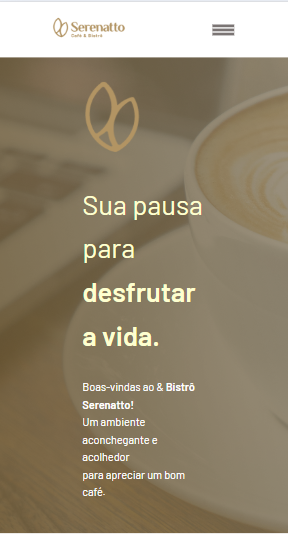
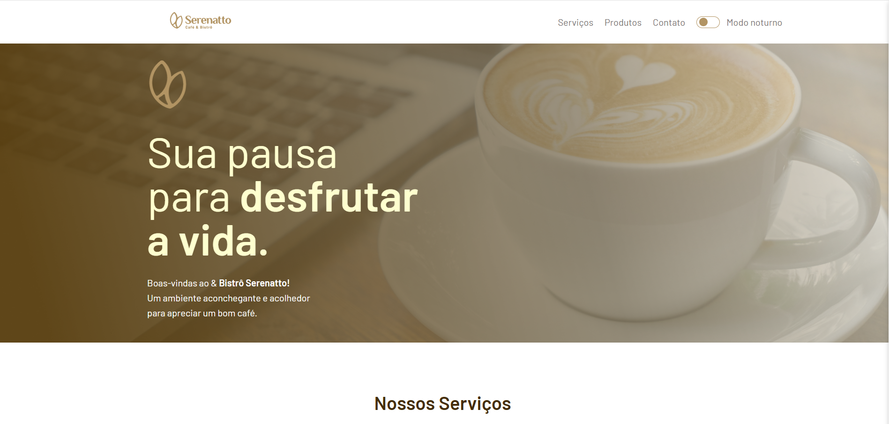

# Serenatto

## ℹ️ Sobre

Projeto utilizado no curso para aprendizado das técnicas e melhores práticas.

## 📘Ementa

### SASS com Vite: otimizando e modularizando seu CSS

- Entender o conceito e as vantagens do SASS sobre o CSS tradicional
- Fazer a compilação de SASS com a ferramenta Vite
- Fazer a modularização dos estilos usando partials e importações
- Aprender como reutilizar o código com mixins e @extend
- Desenvolver funções personalizadas para gerar valores reutilizáveis
- Implementar transições usando mixins

## 🖥️ Tecnologias

  
  
  

## 🧑‍🏫 Instrutor(es)

| [ Nayanne Batista](https://github.com/nayannelbatista) |
| :------------------------------------------------------------------------------------------------------------------------------------------------------------: |

## 💻 Screenshot

#### Mobile

  

#### Tablet

  
  
  #### Desktop
  

